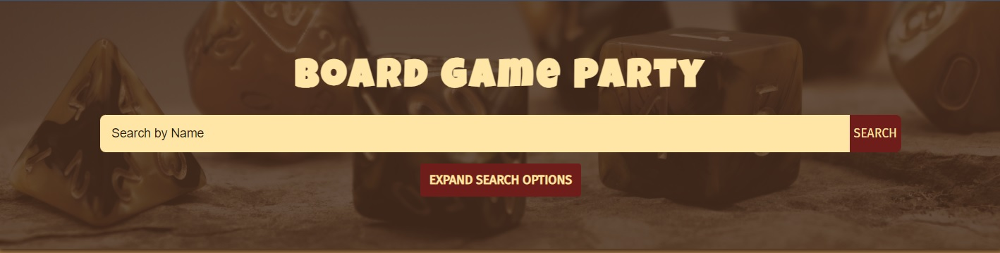
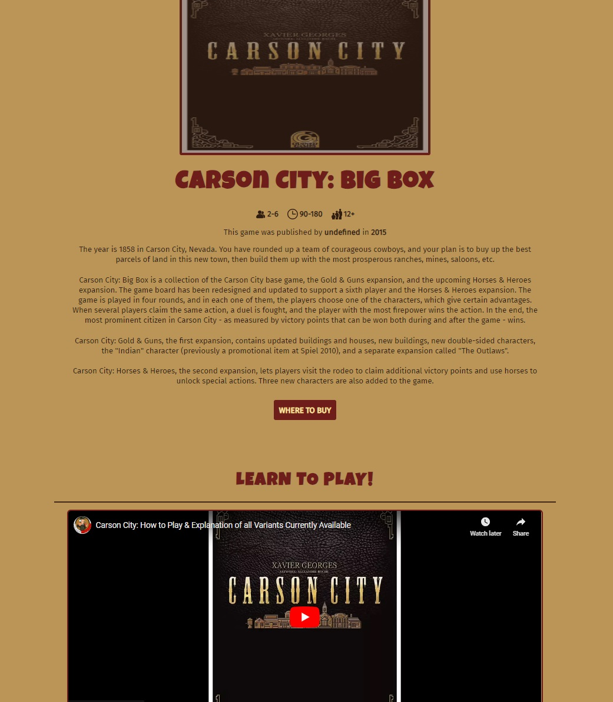
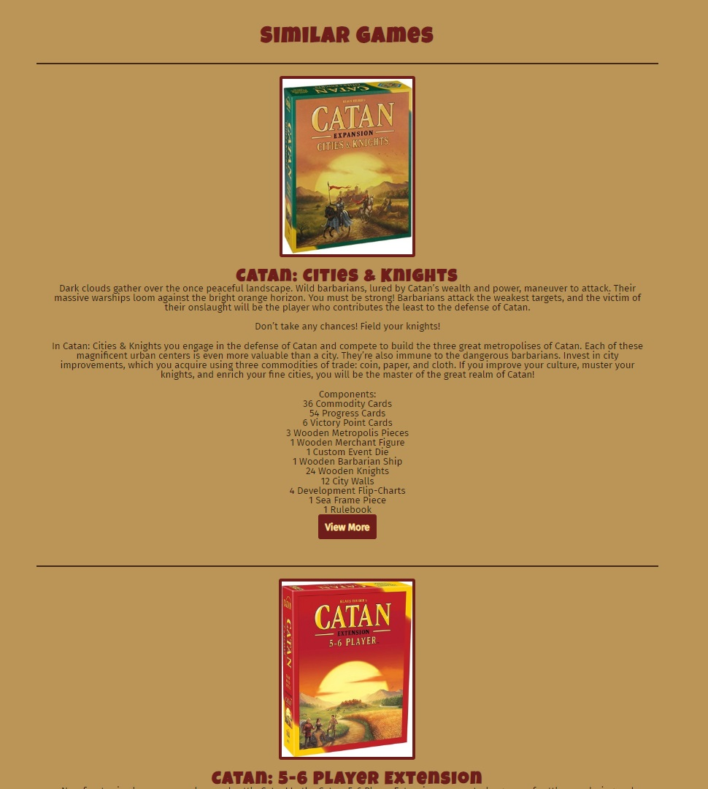

# Board Game Party

## Table of Contents
1. [Description](#description)
2. [Technologies](#technologies)
3. [Installation](#installation)
4. [Usage](#usage)
5. [Contributing](#contributing)
6. [Tests](#tests)
7. [License](#license)
8. [Questions](#questions)
9. [Media](#media)

## Description
This was originally a collaborative project done between myself and my classmates. The  repository can be found [HERE](https://github.com/Bram-G/Board-Game-Party) and the deployment [HERE](https://bram-g.github.io/Board-Game-Party/). I sought to build this project on my own as a way to challenge myself and continually learn. I decided to build this from scratch and to eliminate the use of frameworks. I also wanted to focus more on mobile responsiveness and create an application that works well on all screen sizes.

This project offers an easy to use application that allows you to quickly find board games based off of search criteria. Board Game Party displays a game's information such as number of players, time to play, age group, and it's description. The application also lets you quickly navigate to where the game can be bought. Furthermore, every searched game will generate a youtube tutorial video on the game as well as a list of similar games.

## Technologies
- HTML
- CSS
- JavaScript
- [Board Game Atlas API](https://www.boardgameatlas.com/api/docs)
- [YouTube API](https://developers.google.com/youtube/v3)

## Installation
No installation is necessary for this project, you can access this application at the following [link](https://bgp-solo-52397be8b8c1.herokuapp.com/index.html). 

## Usage
Quickly search and learn about the next best game for your board game parties.

## Contributing
This application is open source and can be accessed and used by anyone. If you would like to make contributions to my repository, feel free to reach out to me at the email provided below and I'll respond as soon as able.

## Tests
No test suites have been run on this application at this time. All tests were done manually by myself to ensure functionality.

## License
This application is currently covered under the MIT License. More information about this license can be viewed under the file named 'LICENSE' in the repository.

## Questions
If you have any questions, feel free to reach out to me at my email: djohncaldwell@gmail.com

All of my work can be viewed at my GitHub profile: [CaldwellDerek](https://github.com/CaldwellDerek)

## Media

1.

2.

3.
